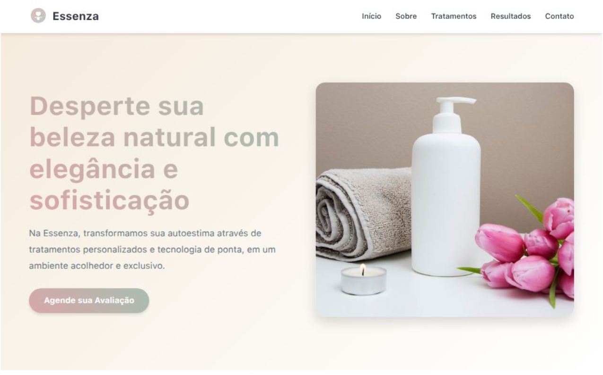

# Essenza - Clínica de Estética

Este projeto é uma landing page moderna e responsiva desenvolvida para a **Essenza**, uma clínica de estética focada em tratamentos faciais e corporais com tecnologia de ponta. A página foi criada para promover os serviços da clínica, aumentar a confiança dos visitantes e incentivar o agendamento de avaliações.

## 🎯 Objetivo

Apresentar os diferenciais da Essenza com um design elegante, emocional e funcional — otimizando a experiência do usuário e incentivando a conversão de leads.

## 📷 Preview

<div style="display: flex; gap: 10px;">
  
</div>

[👉 Clique aqui para visitar a página](https://landing-page-essenza-aesthetica.vercel.app)

## 🧩 Tecnologias Utilizadas

- **HTML5** — estrutura semântica e organizada
- **CSS3** — layout responsivo com grid, animações e transições suaves
- **Google Fonts** — tipografia personalizada com _Poppins_ e _Playfair Display_
- **SVGs e imagens otimizadas** — ícones leves e ilustrações impactantes
- **Design Responsivo** — compatível com dispositivos móveis e desktop
- **JavaScript (simples)** — interações básicas como slider de depoimentos e FAQ

## 🖼️ Seções da Página

- **Header** com navegação fluida
- **Hero** com chamada principal e CTA
- **Sobre** a clínica
- **Tratamentos** (faciais, corporais e tecnológicos)
- **Diferenciais** que destacam a marca
- **Antes e Depois** (com slider interativo)
- **Depoimentos** de clientes
- **FAQ** interativo
- **Formulário de Contato** com seleção de interesse
- **Rodapé** com links e direitos autorais

## 🚀 Como Rodar Localmente

1. Clone este repositório:
   ```bash
   git clone https://github.com/seu-usuario/essenza-estetica.git
   ```
2. Abra o arquivo `index.html` em seu navegador.

## 📩 Contato

Se quiser adaptar este projeto para seu negócio, entre em contato comigo por e-mail ou pelas redes sociais:

- ✉️ ivannatech@gmail.com
- 💼 [LinkedIn](https://www.linkedin.com/in/ivanna-almeida/)
- 🖥️ [GitHub](https://github.com/ivannatech)

---

> Este projeto é parte de um portfólio de desenvolvedora web freelancer e está disponível para uso não-comercial ou como base para novos projetos personalizados.
